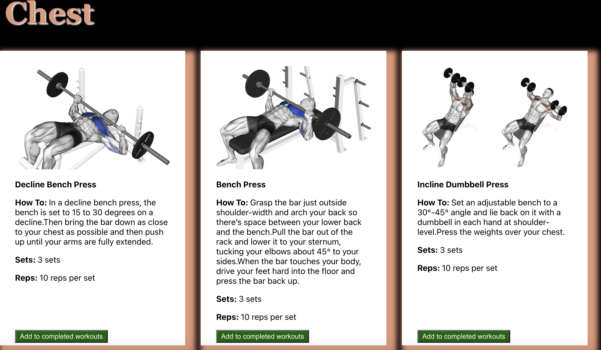
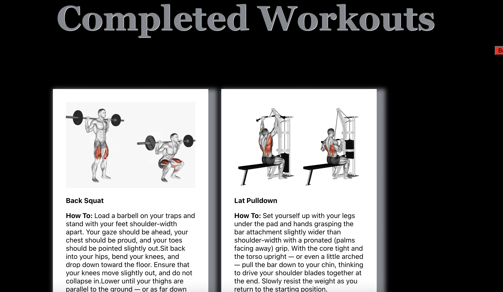

# Body Geek
 
-  This is a gym website that has a list of workouts and separted by parts of your body. It also gives you an option to mark one as completed and it adds it to your completed collection and is time stamped to when it was added.
 
 

## Sign Up Page

There is also a Login page thats very similar.
 
 

## Logged In 
 
- Once your logged in you will arrive to a workout page. Where you will see a list of workouts and you have the option to click the green button and add them to your completed collection. Like the image below.
 

 

## Completed Section
 
- Once you've completed your workout and added it to the completed section it will appear on this page like shown below. Even though it doesn't show, it is timestamped to when you completed each workout.
 
